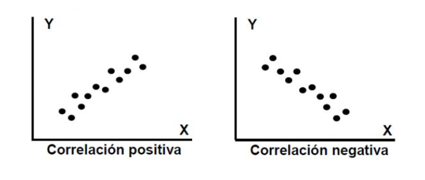

```{r setup, include=FALSE}
knitr::opts_chunk$set(echo = FALSE)
library(car)
library(lmtest)
library(ggplot2)
library(dplyr)
library(permute)
library(knitr)
# library(kableExtra)
```

# PLAN DE LA CLASE
**1.- Introducción**
    
- ¿Qué son las pruebas no paramétricas?.
- Test de Correlación no paramétrico.
- Pruebas de contraste no paramétrico.
- Prueba de asociación Chi cuadrado.

**2.- Práctica con R y Rstudio cloud**

- Realizar pruebas no paramétricas.  
- Realizar gráficas avanzadas con ggplot2. 

# MÉTODOS NO PARAMÉTRICOS

- Conjunto diverso de pruebas estadísticas.

- El concepto de “no paramétrico” a veces es confuso, pues los métodos no paramétricos si estiman y someten a prueban hipótesis usando parámetros, pero no los de distribución normal.

- Se aplican usualmente para variables cuantitativas que no cumplen con el supuesto de normalidad y para variables cualitativas.

- Alternativamente se conocen como métodos de distribución libre.

- El concepto matemático de permutación está subyacente a muchos métodos no paramétricos y se utiliza para someter a prueba las hipótesis.

# SUPUESTOS DE LOS MÉTODOS NO PARAMÉTRICOS

- Las variables son independientes.

- Muestras independienteds tienen identica distribución.

- No tienen supuestos acerca de la distribución de la variable.

- La distribución muestreal se estima a veces usando permutación.

# PRUEBA DE CORRELACIÓN NO PARAMÉTRICA

**¿Para que sirve?**    
Para estudiar asociación de dos variables, cuando no se cumple uno o varios supuestos de la correlación paramétrica: 

- Las variables X e Y no son continuas.  
- No existe relación lineal.  
- La distribución conjunta de (X, Y) no es una distribución Bivariable normal.  

```{r, echo=FALSE, out.width = '80%', fig.align='center'}


``` 

# CORRELACIÓN NO PARAMÉTRICA 

- Se basa en calcular el ranking de las variables.
- Calculamos ranking para cada variable.

|  **Fish size (X)** | **Parásitos (Y)**| **Ranking X ** | **Ranking Y** | 
|:-----:|:-----:|:-------:|:------:|
| 942 | 13 | 4 | 2 | 
| 101 | 14 | 1 | 3 | 
| 313 | 18 | 2 | 4 | 
| 800 | 10 | 3 | 1 | 

- Si la correlación es +, valores ordenados.
- Si la correlación en -, valores en orden inverso.
- Si la correlación es 0, valores desordenados.


# COEFICIENTE DE CORRELACIÓN DE SPEARMAN

**¿Cómo se calcula?**   

::: columns

:::: column

**Ranking X ** | **Ranking Y** | $$d$$  | $$d^2$$ |
|:-------:|:------:|:------:|:------:|
| 4 | 2 | 2 | 4 |
| 1 | 3 | -2 | 4 |
| 2 | 4 | -2 | 4 |
| 3 | 1 | 2 | 4 |

::::

:::: column

$$\rho = 1- \frac {6\sum d^2}{n(n^2-1)} = $$ 

$$\sum d^2 = 16$$   

$$\rho = 1- \frac {6*16}{4(4^2-1)} = $$ 

$$rho= -0,6 $$

::::

:::


# PRUEBA DE HIPÓTESIS DE CORRELACIÓN

|  **Hipótesis de dos colas** | **Verdadera cuando**| 
|:-------------|:------------------|
| **H~0~**: X e Y mutuamente independientes | $$\rho$$ = 0|
| **H~1~**: X e Y no son mutuamente independientes | $$\rho$$ $$\ne$$ 0|


# PRUEBA DE CORRELACIÓN CON R

```{r}
# Crea objetos X e Y 
X <- c(942,101,313,800)
Y <- c(13,14,18,10)
```


```{r, echo=TRUE}
# Realiza test de correlación
cor.test(X,Y, method = "spearman",
         alternative = "two.sided")

```

No se rechaza **H~0~** porque p = 0,416 es mayor a 0,05

# COMPARACIÓN DE MUESTRAS INDEPENDIENTES

**¿Para qué sirve?**   
Para comparar dos muestras con idéntica distribución, con diferentes medianas y sin normalidad.

Usualmente para variables discretas.

```{r, echo=FALSE, out.width = '70%' }
knitr::include_graphics("No_par.png")
```

# PRUEBA DE MANN-WHITNEY (W)

Estudio de caso: Conducta agresiva (minutos de pelea) entre tilapias cultivadas en estanque mosexo (Tratamiento: solo machos) y estanques mixtos (Control: Machos y hembras) [**Link**](https://doi.org/10.1590/S1519-69842008000400015)

|  **Tratamiento (T)** | **Control (C)**| 
|:----------:|:---------:|
| 9 | 0 |
| 12 | 4 | 
| 13 | 6 | 

# CÁCULO ESTADÍSTICO MANN-WHITNEY (W)

**¿Cómo se calcula el estadístico W?**   
Como la diferencia de los ranking entre tratamiento y control

|  **Tratamiento (T)** | **Control (C)**| **Ranking T ** | **Ranking C** |
|:----------:|:---------:|:--------:|:--------:|
| 9 | 0 | 4 | 1 | 
| 12 | 4 | 5 | 2 | 
| 13 | 6 | 6 | 3 | 
|  |  |  $$\sum$$ = 15 | $$\sum$$ = 6 |

*W* = 15 - 6 = 9  
Máxima diferencia posible entre T y C.

# PRUEBA DE HIPÓTESIS DE MANN-WHITNEY

|  **Hipótesis de 2 colas** |
|:-------------:|
| **H~0~**: Tratamiento = Control |
| **H~1~**: Tratamiento $$\ne$$ Control | 

::: columns

:::: column

|  **Hipótesis 1 cola** |
|:-------------:|
| **H~0~**: Tratamiento = Control |
| **H~1~**: Tratamiento > Control | 

::::

:::: column


|  **Hipótesis 1 cola** |
|:-------------:|
| **H~0~**: Tratamiento = Control |
| **H~1~**: Tratamiento < Control | 

::::

:::

# PRUEBA DE MANN-WHITNEY CON R

```{r}
# Crea objetos tratamiento y control
t <- c(9, 12, 13)
c <- c(0, 4, 6)
```


```{r, echo=TRUE}
# Realiza prueba de Mann-Whitney
wilcox.test(t, c, alternative = "g",
            paired = FALSE)
```

No se rechaza **H~0~** porque p = 0,05

# COMPARACIÓN DE MUESTRAS PAREADAS

**¿Para que sirve?**   
Para comparar dos muestras *pareadas* con idéntica distribución, con diferentes medianas y sin normalidad.

```{r, echo=FALSE, out.width = '90%' }
knitr::include_graphics("pareadas.png")
```

# PRUEBA DE WILCOXON MUESTRAS PAREADAS

Estudio de caso: Gonadotrofina en trucha 7 y 14 días [**post ovulación.**](https://hal.inrae.fr/hal-02714224/document)

¿Aumenta la gonadotrofina post ovulación?

|  **Trucha** | **7 días**| **14 días** | $$d$$ |  Ranking con signo |
|:------:|:------:|:------:|:------:|:-------:|
| 1 | 45 | 49 | 4 | **2** |
| 2 | 41 | 50 | 9 | **4** |
| 3 | 47 | 52 | 5 | **3** |
| 4 | 52 | 50 | 2 | **-1** |

W = suma de los ranking = 8  
V = suma de casos positivos (aumenta) = 9


# PRUEBA DE HIPÓTESIS DE WILCOXON

|  **Hipótesis 2 colas ** |
|:-------------:|
| **H~0~**: d = 0 |
| **H~1~**: d $$\ne$$ 0 | 


::: columns

:::: column


|  **Hipótesis 1 cola** |
|:-------------:|
| **H~0~**: d = 0 |
| **H~1~**: d < 0 | 

::::

:::: column

|  **Hipótesis 1 cola** |
|:-------------:|
| **H~0~**: d = 0 |
| **H~1~**: d > 0 | 

::::

:::

# PRUEBA DE WILCOXON PAREADAS CON R

```{r}
# Crea objetos pre y post
pre <- c(45, 41, 47, 52)
post <- c(49, 50, 52, 50)
```


```{r, echo=TRUE}

# Realiza prueba de Wilcoxon
wilcox.test(post - pre, alternative = "greater")
# no es necesario indicar muestras pareadas
# pues estamos haciendo la resta en la función.

```

# COMPARACIÓN DE MÚLTIPLES MUESTRAS INDEPENDIENTES

**¿Para que sirve?**   
Para comparar múltiples muestras con idéntica distribución, con diferentes medianas y sin normalidad.

```{r, echo=FALSE, out.width = '90%' }
knitr::include_graphics("multiple.png")
```

# ESTUDIO DE CASO: SCORE CALIDAD CAMARÓN

Score de calidad organoléptica (textura) de camarón [**link**](https://iopscience.iop.org/article/10.1088/1755-1315/564/1/012040/pdf).

|  **Descripción** | **Puntaje**|
|:----:|:---:|
| Muy compacto y denso  | 9
| Menos elástico, compacto y denso | 7 | 
| No elástico, no compacto y no denso| 5 | 
| Ligeramente blando| 3 | 
| Suave| 1 | 

# PRUEBA DE KRUSKAL - WALLIS

Textura luego de 0, 4 y 8 días de almacenamiento de camarón congelado.

|  **0 días** | **4 días**| **8 días** | 
|:----:|:---:|:---:|
| 9 | 7 | 6 | 
| 8 | 7 | 5 | 
| 9 | 6 | 5 | 
| 8 | 8 | 6 |

|  **Hipótesis** |
|:-------------:|
| **H~0~**: La distribución de los k grupos son iguales. |
| **H~1~**: Al menos 2 grupos son distintos. | 

# PRUEBA DE KRUSKAL - WALLIS CON R

```{r}
d0 <- c(9,8,9,8) # day0
d4 <- c(7,7,6,8) # day4 
d8 <- c(6,5,5,6) # day8
```


```{r, echo=TRUE}

kruskal.test(list(d0, d4, d8))

```

# PRUEBA DE ASOCIACIÓN VARIABLES CATEGÓRICAS

**¿Para que sirve?**  
Se utilizan para investigar la asociación de dos o más variables categóricas una de las cuales es una variable respuesta y la otra es una variable predictora.

|  **Tratamiento** | **Respuesta +**| **Respuesta -** | 
|:----|:---|:---|
| Si | a | c | 
| No | b | d | 

# PRUEBA DE CHI CUADRADO

Esta prueba contrasta frecuencias observadas con las frecuencias esperadas de acuerdo con la hipótesis nula.

|  **Hipótesis** |
|:-------------:|
| **H~0~**: La variable predictora y la variable respuesta son independientes (Tratamiento = control) |
| **H~1~**: La variable predictora y la variable respuesta NO son independientes | 

**Supuestos:**  
- Los datos provienen de una muestra aleatoria de la población de interés.  
- El tamaño de muestra es lo suficientemente grande para que el número esperado en las categorías sea mayor 5 y que ninguna frecuencia sea menor que 1. 

# ESTUDIO DE CASO: SOBREVIVENCIA MANCHA BLANCA CAMARÓN

Sobrevivencia de postlarvas  alimentadas con *B* glucanos y desafiadas con WSSP  [**Chang et al., 1999**](https://www.int-res.com/articles/dao/36/d036p163.pdf).

|  **Tratamiento** | **Sobrevivientes**| **Muertos** | 
|:----|:---|:---|
| Con glucanos | 20 | 80 | 
| Sin glucanos | 5 | 95 | 

# CÁLCULO DE ESTADÍSTICO CHI CUADRADO

**¿Cómo se calcula el estadístico Chi cuadrado?**   

$$ X^2 = \sum \frac {(freq. obs. - freq. esp.)^2}{(freq. esperada)} = \sum \frac {(O - E)^2}{(E)}$$

```{r}
# Crea matriz de datos
datos <- c(20, 5, 80, 95)
dim(datos) <- c(2,2)
```

Frecuencia esperada
```{r, echo=FALSE}
# Test de Chi-squared en R (chisq.test)
test<-chisq.test(datos, correct = FALSE)
test$expected
test$statistic
```


# PRUEBA DE CHI CUADRADO CON R
```{r, echo=TRUE}

# Test de Chi-squared en R (chisq.test)
chisq.test(datos, correct = FALSE)
```

# PRÁCTICA ANÁLISIS DE DATOS

- Guía de trabajo práctico disponible enRstudio.cloud.  
**Clase_07**

# RESUMEN DE LA CLASE

Revisión de conceptos de estadística no paramétrica.  

-  Correlación de Spearman.  
-  Prueba de Man-Whitney.    
-  Prueba de Wilcoxon.  
-  Prueba de Kruskal Wallis.  
-  Prueba de Chi-cuadrado.  
