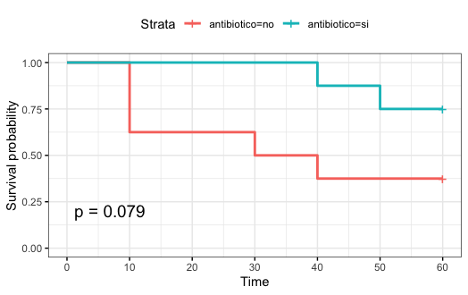
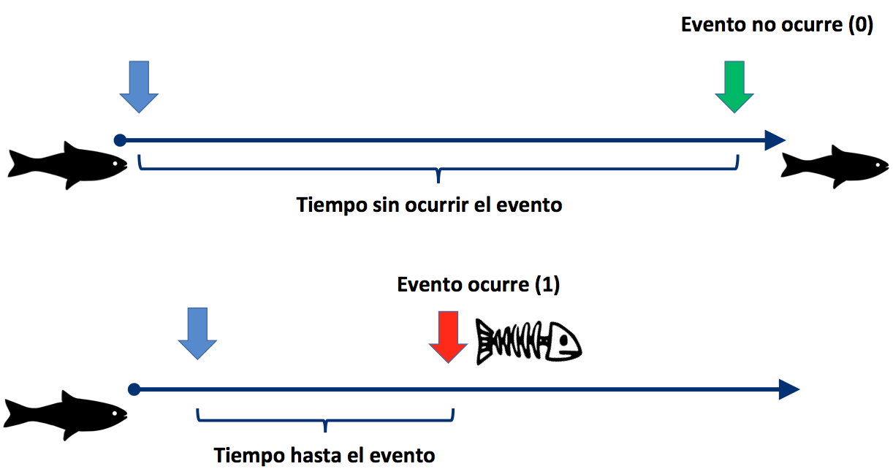
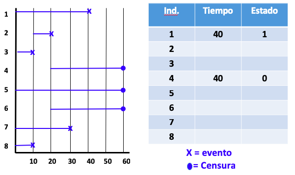
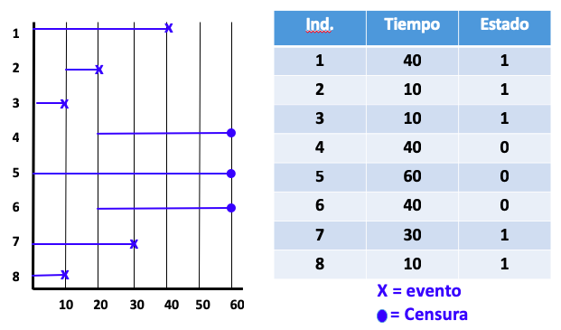
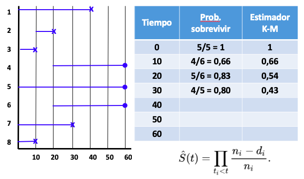
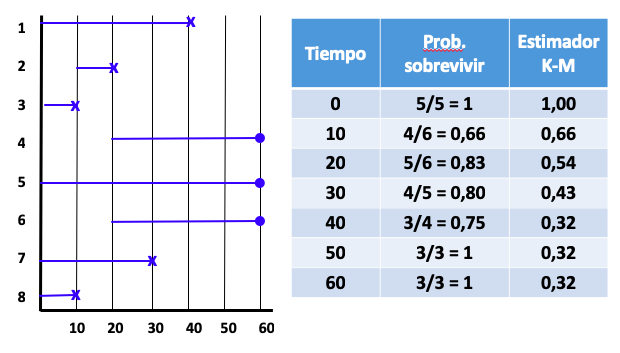
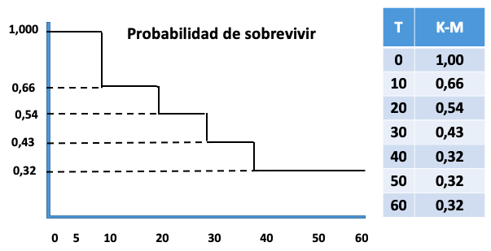

```{r setup, include=FALSE}
knitr::opts_chunk$set(echo = FALSE)
library(readxl)
library(dplyr)
library(ggplot2)
library(knitr)

```

# PLAN DE LA CLASE

**1.- Introducción**
    
- Qué son los análisis de sobrevivencia?
- Método de Kaplan-Meier.
- Test estadístico.
- Interpretación pruebas con R

**2.- Práctica con R y Rstudio cloud.** 

- Realizar análisis de sobrevivencia.  
- Realizar gráficas avanzadas con ggplot2.  

# ANÁLSIS DE SUPERVIVIENCIA

Conjunto de herramientas estadísticas No paramétricas utilizadas
para analizar la probabilidad de que un evento (muerte/falla)
ocurra en un determinado Tiempo.

```{r, echo=FALSE, out.width = '80%' }

```

# CONCEPTOS RELEVANTES

Variables respuesta: Tiempo de supervivencia y Estado (0 - 1).

```{r, echo=FALSE, out.width = '100%' }

```

# CONCEPTOS RELEVANTES: DATOS CENSURADOS

- Los organismos pueden entrar en diferentes tiempos al estudio.
- El evento puede ocurrir después de finalizar el estudio (Censurar datos).

```{r, echo=FALSE, out.width = '90%' }

```

# EJEMPLO SET DE DATOS 

```{r, echo=FALSE, out.width = '90%' }

```


# MÉTODO DE KAPLAN - MEIER

El método de Kaplan-Meier es un método no paramétrico que estima las probabilidades de supervivencia $S(t)$ en los instantes en los que ha ocurrido el evento.

$$\hat{S(t)} = \prod_{t<t1}\ \frac{n_i-d_i}{n_i}$$

$d_i$, el número de muertes en el momento $t_i$  
$n_i$, el número de sujetos en riesgo justo antes de $t_i$.  

# CALCULAR PROBABILIDAD KM

```{r, echo=FALSE, out.width = '100%' }

```

# CALCULAR PROBABILIDAD KM 

```{r, echo=FALSE, out.width = '100%' }

```

# GRÁFICA DE SOBREVIVENCIA.

```{r, echo=FALSE, out.width = '100%' }

```

# PRUEBA ESTADÍSTICA PARA COMPARAR TRATAMIENTOS

Test estadístico no paramétrico Log rank test.  

$G = 2 \sum_{i}\ O_i ln \frac{O_i}{E_i}$

**Hipótesis**  
**H~0~**: No existen diferencias entre los grupos en la probabilidad de que ocurra un evento (muerte) en ningún tiempo.  
**H~1~**: Existen diferencias entre los grupos en la probabilidad de que ocurra un evento (muerte) en algún tiempo.


| | Grupo 1| Grupo 2|
|:---:|:---:|:---:|
| Evento| Prob. KM  A | Prob. KM  C |
| Sensura | Prob. KM  B | Prob. KM  D | 


[Fuente: The log rank test](https://www.bmj.com/content/328/7447/1073.long)


# PRÁCTICA ANÁLISIS DE DATOS

- El trabajo práctico se realiza en Rstudio.cloud.  

# RESUMEN DE LA CLASE

- Revisión de análisis de supervivencia y tiempos de vida
media o falla.\
&nbsp;
- Cálculo de probabilidad mediante método de Kaplan-
Meier.\
&nbsp;
- Ejetutamos e tnterpretamos resultados test de supervivencia con R.\
&nbsp;
